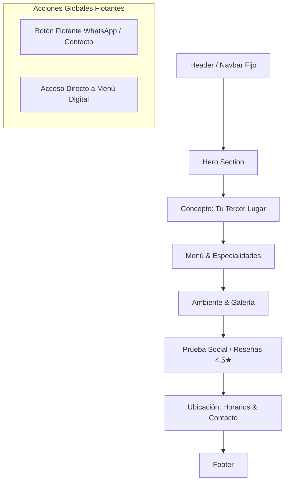

# Documento de Requisitos de Producto (PRD)
## Proyecto: Sitio Web Oficial — Goyo Real Coffee

| Metadato | Detalle |
| :--- | :--- |
| **Producto** | Sitio Web Oficial y Menú Digital Responsive |
| **Cliente / Negocio** | Goyo Real Coffee |
| **Ubicación** | Hermosillo, Sonora, México |
| **Versión del PRD** | 1.0.0 |
| **Estado** | Aprobación de Requisitos (Fase previa a diseño y desarrollo) |
| **Fuente de Datos** | `research.md` (Investigación previa de mercado, Google Maps e Instagram) |

---

## 1. Resumen Ejecutivo y Contexto

**Goyo Real Coffee** es una cafetería de especialidad ubicada en la colonia Nayarit de Hermosillo, Sonora. Su concepto central gira en torno al **"tercer lugar"** (un espacio íntimo entre el hogar y el trabajo para pausar, sentir y desconectar), destacando por la alta calidad de su matcha auténtico, su café de especialidad y sus jarabes caseros.

Actualmente, el negocio **carece de un sitio web oficial** (la ficha de Google Maps muestra "Agregar sitio web" pendiente) y centraliza su presencia digital casi exclusivamente en su perfil de Instagram (`@goyorealcoffee`, ~5.9K seguidores). Aunque cuenta con una reputación positiva y sólida (4.5/5 estrellas en Google Maps con 165 reseñas), sufre de fricciones operativas detectadas en opiniones (horas pico con servicio demorado y espacio físico reducido), así como una oportunidad desaprovechada de captura de tráfico local orgánico en Google.

Este documento formaliza las especificaciones funcionales, de contenido y técnicas para el desarrollo del sitio web oficial de Goyo Real Coffee, transformando los hallazgos de investigación en requerimientos de producto rigurosos.

---

## 2. Matriz de Evidencia: Hechos vs. Inferencias

Para garantizar la fidelidad con los datos disponibles y evitar asumir información no comprobada, el proyecto se rige bajo la siguiente separación estricta:

### 2.1. Hechos Comprobados (Datos verificados en la investigación)
* **Razón / Nombre comercial:** Goyo Real Coffee.
* **Ubicación física:** Av. Nayarit y Yáñez 102, Nayarit 4, C.P. 83190 Hermosillo, Sonora (esquina de Av. Nayarit y calle Yáñez).
* **Código Plus Google:** `32VR+VG Hermosillo, Sonora`.
* **Teléfono:** `662 355 7949`.
* **Horarios oficiales:**
  * Lunes a Viernes: 7:00 a.m. – 9:00 p.m.
  * Sábados y Domingos: 9:00 a.m. – 9:00 p.m.
  * Frecuencia: Abierto todos los días.
* **Calificación y reputación:** 4.5/5 estrellas en Google Maps basado en 165 reseñas registradas.
* **Ticket promedio informado:** Rango de $100 a $200 MXN por persona (declarado por 90 usuarios en Google Maps).
* **Posicionamiento oficial (Bio Instagram):** *"Un lugar para pausar y sentir. Tu esquina favorita. Tu tercer lugar."*
* **Declaración del propietario en reseñas:** *"Somos una esquina pequeña pero intentamos que cada visita se sienta especial."*
* **Productos destacados confirmados por clientes:**
  * Matcha latte (ampliamente elogiado: "realmente sabe a matcha", calificado "1000/10").
  * Café de especialidad (bebidas calientes y frías, cortado, café americano/espresso).
  * Bebidas con leche y foam de alta calidad.
  * Jarabes artesanales hechos en casa y sabores de temporada.
  * Té matcha y té con leche.
  * Postres y galletas (con una crítica documentada de inconsistencia sobre una galleta de chocolate con caramelo).
  * "Menú del día" publicado de manera periódica en Instagram.
* **Puntos de dolor operativos documentados:**
  * Demoras en horas pico con acumulación de pedidos y momentos con personal limitado (ej. una sola barista para alta afluencia).
  * Espacio físico reducido / aforo limitado.
* **Canales digitales activos:**
  * Instagram: `@goyorealcoffee` (~5.9K seguidores, ~83 publicaciones).
  * TikTok: Presencia orgánica mediante contenido generado por usuarios/influencers locales (sin perfil verificado propio).
* **Estado web:** Sin sitio web existente.

### 2.2. Inferencias (Hipótesis fundamentadas que requieren validación)
* **WhatsApp:** Se infiere que la línea telefónica `662 355 7949` opera como canal de WhatsApp / WhatsApp Business habitual en comercios de la región, pero debe confirmarse antes de asociar el enlace directo `wa.me`.
* **Perfil demográfico:** Adultos jóvenes de 18 a 35 años (estudiantes universitarios, profesionistas en trabajo remoto/híbrido, creativos), predominantemente atraídos por estética cuidada, bebidas en tendencia (matcha) y espacios tranquilos para lectura o trabajo individual/parejas.
* **Tipología de alimentos:** Se infiere que el "Menú del día" rotativo abarca opciones de repostería fresca, panadería y posibles opciones ligeras de desayuno/brunch.
* **Uso in-situ del sitio web:** Un menú digital accesible vía QR dentro del local puede aliviar la carga de atención al cliente en mostrador durante horas de alta concurrencia.

---

## 3. Objetivos del Producto

### 3.1. Objetivos de Negocio
1. **Establecer presencia digital propia e independiente:** Disminuir la dependencia absoluta de Instagram, dotando a la marca de un canal oficial indexable.
2. **Mejorar la discoverabilidad local (SEO Local):** Posicionar la cafetería en Google Search y Google Maps para búsquedas de alta intención en Hermosillo (*"matcha en Hermosillo"*, *"cafetería aesthetic Hermosillo"*, *"café de especialidad cerca de mí"*).
3. **Optimizar la rotación y experiencia operativa:** Facilitar el acceso inmediato al menú digital (vía web y código QR en mesas/barra) para que el cliente consulte precios y opciones antes o durante su turno, reduciendo filas y tiempos muertos.
4. **Clarificar expectativas de aforo:** Comunicar con elegancia la naturaleza acogedora e íntima del local (*"tu esquina favorita"*) para alinear las expectativas de espacio de los visitantes.

### 3.2. Objetivos de Usuario (Experiencia de Visita)
1. **Acceso sin fricciones:** Conocer en menos de 5 segundos el horario de hoy, si está abierto actualmente, cómo llegar y en qué rango de precio se encuentra.
2. **Exploración visual y certera del menú:** Visualizar la oferta real (en especial matcha, café de especialidad y jarabes caseros) con claridad de precios y descripciones apetecibles.
3. **Certeza de calidad:** Confirmar mediante prueba social auténtica (reseñas de 4.5 estrellas) que el producto y la atención justifican la visita.
4. **Canal de contacto directo:** Posibilidad de contactar al establecimiento mediante un solo clic (llamada o mensajería).

---

## 4. Público Objetivo y Segmentación

| Arquetipo | Motivaciones Principales | Necesidad en la Web |
| :--- | :--- | :--- |
| **El Entusiasta del Matcha & Café** | Busca autenticidad en insumos (matcha real no industrial, grano de especialidad, jarabes caseros). Valora la técnica y el sabor. | Ver el menú especializado, comprobar la procedencia artesanal de las bebidas y leer reseñas que avalen la calidad. |
| **El Buscador del "Tercer Lugar"** | Profesionista independiente, estudiante o lector que busca un refugio acogedor entre casa y trabajo para concentrarse o conversar. | Conocer el ambiente, validar la tranquilidad del lugar, horarios continuos (abierto de 7am a 9pm) y ubicación accesible. |
| **El Explorador de Experiencias Aesthetic** | Joven atraído por el diseño, la atmósfera fotogénica, la vajilla y la estética del espacio para compartir en redes. | Galería visual rica, tipografía y diseño web que transmitan calidez y modernidad, enlace directo a Instagram. |

---

## 5. Propuesta de Valor y Tono de Comunicación

### 5.1. Declaración de Propuesta de Valor
> *"Goyo Real Coffee es tu esquina acogedora en Hermosillo: un tercer lugar creado para pausar y sentir, donde el matcha auténtico, el café de especialidad y los jarabes hechos en casa se disfrutan con una atención cercana y sin prisas."*

### 5.2. Pilares de la Marca a Reflejar
1. **Autenticidad:** Matcha real (calidad certificada por los clientes), café de especialidad y jarabes caseros.
2. **Intimidad y Pausa:** Un espacio pequeño pero lleno de calidez, alejado del ruido y la estandarización de las grandes cadenas.
3. **Hospitalidad Genuina:** Servicio cercano, humano y empático reflejado en cada interacción.

### 5.3. Tono y Voz
* **Cálido, sereno y hospitalario:** Cercano como el trato de un barista amigo, sin tecnicismos pretenciosos ni formalismos corporativos fríos.
* **Conciso y transparente:** Información directa de horarios, precios y ubicación.
* **Uso medido de iconografía y recursos emocionales:** Integración orgánica de elementos visuales acordes al café y matcha (tonos tierra, beige y verde matcha).

---

## 6. Arquitectura de Información y Estructura de Secciones

El sitio web se estructurará como una **Single Page Application (SPA) / Landing Page de alto impacto**, complementada con navegación por anclas suaves (`smooth scroll`) y una vista dedicada o modal optimizado para el **Menú Digital**.

### Detalle de Secciones:

#### 1. Encabezado de Navegación (Sticky Header)
* **Logotipo / Identificador de marca:** Goyo Real Coffee.
* **Enlaces de navegación:**
  * El Concepto (`#concepto`)
  * Menú (`#menu`)
  * Galería (`#galeria`)
  * Reseñas (`#resenas`)
  * Ubicación & Horarios (`#visitanos`)
* **Indicador de estado en tiempo real:** Badge dinámico (*"Abierto ahora"* / *"Cerrado ahora"*) calculado según los horarios oficiales comprobados.
* **CTA destacado en Navbar:** Botón *"Ver Menú"*.

#### 2. Sección Principal (Hero Section)
* **Titular Principal (H1):** *"Un lugar para pausar y sentir. Tu esquina favorita en Hermosillo."*
* **Subtítulo:** Café de especialidad, matcha auténtico y jarabes caseros en un ambiente pensado para ser tu tercer lugar.
* **Badges de Confianza Rápidos:**
  * ★ 4.5 en Google Maps (165+ reseñas)
  * Abierto todos los días (desde las 7:00 a.m. L-V)
  * Rango promedio: $100–$200 MXN
* **CTAs Principales:**
  * Primario: Botón *"Explorar Menú"* (scroll a `#menu`).
  * Secundario: Botón *"Cómo Llegar"* (abre Google Maps con la ubicación verificada).

#### 3. Sección Concepto: "Tu Tercer Lugar"
* **Narrativa de marca:** Explicar el concepto de la "esquina pequeña pero especial", un refugio entre el trabajo y la casa diseñado para desconectar.
* **Diferenciadores comprobados:**
  * **Matcha 100% auténtico:** Sabor genuino, sin diluciones industriales.
  * **Jarabes artesanales y temporadas:** Elaborados en casa, aportando notas únicas a cada taza.
  * **Atención cercana:** Servicio personalizado por baristas apasionados.
  * **Espacio íntimo:** Una atmósfera relajada y tranquila.

#### 4. Sección Menú & Especialidades
* **Sistema de pestañas / filtros por categorías comprobadas:**
  1. **Matcha & Tés:** Matcha Latte (frío/caliente), Foam Matcha, Té Matcha, Té con leche.
  2. **Café de Especialidad:** Espresso, Americano, Cortado, Latte, Bebidas con foam artesanal.
  3. **Sabores de Temporada & Jarabes Caseros:** Bebidas con recetas de la casa y syrups naturales.
  4. **Postres & Menú del Día:** Galletas horneadas, repostería y opciones rotativas del día.
* **Detalle por ítem:** Nombre del producto, descripción de ingredientes/elaboración, distintivo especial (ej. *"Favorito de la casa"*) e indicador de rango de precios.
* **Nota informativa transparente:** Indicación clara del ticket promedio informado ($100–$200 MXN) y aviso para consultar variaciones de temporada en mostrador.
* **Acceso QR:** Opción para escanear o compartir el enlace directo al menú.

#### 5. Sección Galería & Ambiente
* Cuadrícula fotográfica adaptable con estética visual cuidada:
  * Presentación de bebidas insignia (matcha espumoso, latte art).
  * Vistas del interior del local (mesas, detalles arquitectónicos, luz natural).
  * El factor humano (baristas preparando café con esmero).
* Integración de enlace directo a Instagram (`@goyorealcoffee`) para incentivar a seguir la cuenta y ver historias del día.

#### 6. Sección Prueba Social (Reseñas Verificadas)
* **Calificación destacada:** Badge central de Google Maps `4.5 / 5.0` basado en 165 reseñas.
* **Citas reales seleccionadas de clientes (extraídas de la investigación):**
  * *"El matcha latte es 1000/10, realmente sabe a matcha auténtico."*
  * *"Un café delicioso, personal súper amable y baristas bien buena onda."*
  * *"Amé la estética de este lugar, es pequeño pero muy acogedor."*
  * *"Los jarabes caseros y sabores de temporada hacen toda la diferencia."*
* **Cita del propietario (reflejando la cultura del local):**
  * *"Somos una esquina pequeña pero intentamos que cada visita se sienta especial."*

#### 7. Sección Ubicación, Horarios & Visítanos
* **Ubicación exacta:** Av. Nayarit y Yáñez 102, Col. Nayarit, Hermosillo, Sonora.
* **Código Plus:** `32VR+VG Hermosillo, Sonora`.
* **Horarios desglosados:**
  * Lunes a Viernes: `7:00 a.m. – 9:00 p.m.`
  * Sábados y Domingos: `9:00 a.m. – 9:00 p.m.`
* **Mapa interactivo:** Integración de Google Maps embebido con marcador exacto y botón directo a navegación GPS (Google Maps / Waze).
* **Canales de contacto directo:**
  * Teléfono: `662 355 7949`
  * Instagram: `@goyorealcoffee`
  * Enlace directo a llamada telefónica y chat de WhatsApp.

#### 8. Pie de Página (Footer)
* Resumen de identidad y derechos reservados.
* Enlaces rápidos a secciones del sitio.
* Horario condensado y dirección.
* Enlaces a redes sociales (Instagram).

---

## 7. Requerimientos Funcionales (RF)

| ID | Requerimiento | Descripción | Prioridad |
| :--- | :--- | :--- | :--- |
| **RF-01** | **Navegación Fluida** | Menú superior con navegación por anclajes suaves a cada sección y comportamiento adaptable en dispositivos móviles (menú hamburguesa accesible). | Alta |
| **RF-02** | **Menú Interactivo Categorizado** | Visualización de la carta filtrable por categorías (Matcha, Café, Jarabes/Temporada, Postres). | Alta |
| **RF-03** | **Calculador de Estado del Local** | Script dinámico en cliente que lea el reloj local y muestre si la cafetería está *"Abierta ahora"* o *"Cerrada ahora (Abre mañana a las 7:00 am)"*. | Media |
| **RF-04** | **Enlace Directo a GPS / Mapa** | Botón que abra la app nativa de mapas con la geolocalización exacta de la esquina de Nayarit y Yáñez. | Alta |
| **RF-05** | **Integración de Contacto Rápido** | Enlace `tel:6623557949` y botón de WhatsApp preconfigurado con mensaje inicial contextualizado (*"Hola Goyo Real Coffee, quiero consultar sobre..."*). | Alta |
| **RF-06** | **Modal / Modo Menú QR** | Vista ligera y optimizada para carga ultra rápida pensada para ser escaneada desde un código QR colocado en las mesas del local. | Alta |
| **RF-07** | **Copia de Dirección al Portapapeles** | Botón interactivo junto a la dirección para que el usuario pueda copiarla con un clic y pegarla en su app de transporte (Uber, Didi). | Baja |
| **RF-08** | **Visualizador de Reseñas** | Carrusel o grid accesible con testimonios reales y enlace directo a la ficha de Google Maps para verificar autenticidad. | Media |

---

## 8. Requerimientos No Funcionales (RNF)

### 8.1. Rendimiento y Velocidad (Core Web Vitals)
* **Tiempo de Carga (LCP):** Menor a 1.8 segundos en conexiones 4G móviles.
* **First Input Delay (FID) / INP:** Menor a 100 ms.
* **Cumulative Layout Shift (CLS):** 0 (cero saltos visuales durante la carga de fuentes o imágenes).
* **Tamaño total de assets:** Optimización extrema de imágenes en formatos modernos (WebP/AVIF) con compresión balanceada.

### 8.2. Diseño Responsivo y Mobile-First
* Más del 85% de las visitas provendrán de smartphones (Instagram bio y búsquedas sobre la marcha en Google Maps).
* La interfaz debe adaptarse de manera óptima a pantallas desde 320px hasta monitores de escritorio 4K.
* Áreas táctiles (*tap targets*) mínimas de 48x48px para todos los botones y enlaces interactivos.

### 8.3. Accesibilidad (a11y)
* Cumplimiento con el estándar **WCAG 2.1 Nivel AA**.
* Ratios de contraste de texto sobre fondo iguales o superiores a 4.5:1.
* Soporte nativo para navegación por teclado con estados de foco visibles (`:focus-visible`).
* Atributos semánticos HTML5 (`<header>`, `<nav>`, `<main>`, `<section>`, `<article>`, `<footer>`) y textos alternativos descriptivos en todas las imágenes.

### 8.4. SEO Local y Visibilidad en Buscadores
* Metaetiquetas estructuradas (Title, Meta Description, Canonical, Open Graph para previsualización enriquecida al compartir enlaces en WhatsApp e Instagram).
* Datos estructurados en formato **JSON-LD (Schema.org)** de tipo `CafeOrCoffeeShop`:
  * Nombre: Goyo Real Coffee
  * Dirección postal completa
  * Coordenadas geográficas y Plus Code
  * Horarios de apertura estructurados (`openingHoursSpecification`)
  * Rango de precios (`priceRange: "$$"`)
  * Teléfono de contacto

---

## 9. Llamados a la Acción (Estrategia de CTAs)

| Tipo de CTA | Texto / Etiqueta | Destino / Acción | Propósito de Conversión |
| :--- | :--- | :--- | :--- |
| **CTA Primario (Hero)** | *"Explorar Menú"* | Ancla suave a `#menu` | Despertar apetito y guiar al usuario a conocer la oferta. |
| **CTA Primario (Ubicación)** | *"Cómo Llegar"* | Apertura de Google Maps | Guiar la visita física del cliente hacia la esquina de Nayarit y Yáñez. |
| **CTA Operativo (Local)** | *"Menú Digital QR"* | Vista simplificada del menú | Permitir lectura ágil desde la mesa para agilizar pedidos. |
| **CTA de Contacto** | *"Escríbenos por WhatsApp"* | `wa.me/526623557949` | Resolver dudas sobre menú del día, disponibilidad o pedidos para llevar. |
| **CTA Social** | *"Síguenos en Instagram"* | `@goyorealcoffee` | Retención, comunidad y fidelización de clientes recurrentes. |

---

## 10. Criterios de Aceptación y Métricas de Éxito

### 10.1. Criterios de Aceptación Técnicos
1. **Lighthouse Score:** Puntuación >= 90 en los cuatro apartados clave de Google Lighthouse (Rendimiento, Accesibilidad, Prácticas Recomendadas y SEO).
2. **Validación de Datos:** Ausencia de datos de marcador de posición (*Lorem Ipsum*) y verificación de que cada dato visible (teléfono, dirección, horarios) corresponda exactamente a lo registrado en el research.
3. **Compatibilidad:** Funcionamiento verificado en navegadores modernos (Chrome, Safari iOS, Firefox, Edge).

### 10.2. Métricas de Éxito del Negocio (KPIs a Medir)
* **Tasa de clics en "Cómo Llegar":** Porcentaje de visitantes que activan la navegación GPS hacia el local.
* **Interacción con el Menú Digital:** Tiempo de permanencia en la sección de menú y tasa de apertura del menú vía QR in-situ.
* **Conversión de contacto:** Número de llamadas o conversaciones iniciadas vía WhatsApp.
* **Crecimiento de tráfico orgánico:** Posicionamiento en el paquete local de Google Maps para términos clave de cafetería y matcha en Hermosillo tras la indexación del dominio.

---

## 11. Información Faltante y Gaps para Etapas Posteriores

Para mantener el principio de **no inventar datos**, se registran formalmente las siguientes dudas y requerimientos de información que el propietario de Goyo Real Coffee debe validar antes del despliegue final:

1. **Carta completa de precios individuales:** Se dispone del ticket promedio general ($100–$200 MXN) y de las categorías principales, pero no del listado exhaustivo de precios unitarios por bebida y tamaño.
2. **Confirmación del canal WhatsApp:** Confirmar si el número `662 355 7949` está activado como cuenta de WhatsApp Business para habilitar la mensajería directa sin riesgo de números no registrados.
3. **Servicios y amenidades específicas:**
   * ¿El local cuenta con red Wi-Fi para clientes y enchufes para laptops? (Dato crítico para el público de "tercer lugar").
   * ¿Es un espacio Pet-friendly?
   * ¿Qué métodos de pago aceptan (efectivo, tarjetas de débito/crédito, transferencias)?
4. **Activos de marca originales:**
   * Archivos vectoriales del logotipo oficial (SVG / AI / PNG en alta resolución).
   * Paleta cromática oficial y tipografías corporativas (si cuentan con manual de identidad).
   * Fotografías de alta resolución de las instalaciones y del personal preparando bebidas.
5. **Políticas de pedidos anticipados:**
   * Validar si admiten pedidos para recoger (*pick-up*) vía WhatsApp para ayudar a mitigar las horas de mayor saturación.
